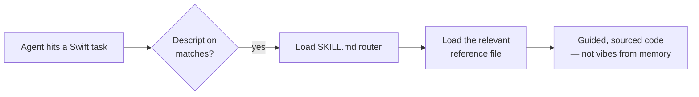

<div align="center">

# Swift Field Guide

**Seventeen species of hard-won Swift knowledge for AI coding agents.**

*Not prompts. Reference libraries your agent loads before it starts guessing from memory.*

[](LICENSE)
[](#-the-catalog)
[](#-install)
[](#-standing-on-giants)

**Claude Code · Codex · OpenCode · any agent that reads SKILL.md**

</div>

---

Most agent skills die of two causes: **overlap** (ten skills fighting over the same territory, so
none loads reliably) and **staleness** (APIs from two OS generations ago). This guide went the
other way — roughly forty overlapping skills from the two most-starred Swift skill packs on GitHub
were merged, de-duplicated, brought current, and pruned into **seventeen**, each with one job and
one reference router.

| The old way | This guide |
|---|---|
| 5 overlapping SwiftUI skills, none authoritative | **`swiftui`** — one flagship, ~30 reference files, flagged conflicts where sources disagreed |
| 4 persistence skills (Core Data, SwiftData, SQLiteData, GRDB) | **`swift-data`** — including the rarest skill of all: *which framework to pick* |
| Separate migration, review, and concurrency skills | **`swift-concurrency`** — 18 references, one entry point |
| Ad-hoc build-speed folklore | **`xcode-build`** + **`spm-build-analysis`** — benchmark, diagnose, prove the win with numbers |

## 🏛 Standing on giants

This guide is a consolidation of the **two most-starred open-source Swift agent skill packs** on
GitHub. Both are MIT licensed, both are excellent standalone — go star them:

| Pack | Author | Stars | License |
|---|---|---|---|
| [SwiftUI-Agent-Skill](https://github.com/twostraws/SwiftUI-Agent-Skill) (+ Concurrency, Testing, SwiftData) | Paul Hudson ([@twostraws](https://github.com/twostraws)) | 4.7k+ | MIT |
| [SwiftUI-Agent-Skill](https://github.com/AvdLee/SwiftUI-Agent-Skill) (+ Concurrency, Core Data, Xcode-Optimization) | Antoine van der Lee ([@AvdLee](https://github.com/AvdLee)) | 3.5k+ | MIT |

What's different here: **fewer, bigger skills** — one router per domain instead of one repo per
topic — plus deprecation tracking, Instruments trace analysis, and documented disagreements
between sources instead of false consensus. Full credit trail in [ATTRIBUTION.md](ATTRIBUTION.md).

## 📖 The catalog

### Language

| Skill | What it does |
|---|---|
| **write-swift** | Modern Swift, done right: value types, Swift 6 data-race safety, `@concurrent`, actors, protocols & generics (`some` vs `any`), API design, performance & ARC, macros. |
| **swift-concurrency** | Tasks, actors, `@MainActor`, `Sendable`, cancellation, `TaskGroup` patterns, Swift 6 migration, concurrency review. |
| **swift-style** | Conventions for clean, readable, idiomatic Swift. |

### UI

| Skill | What it does |
|---|---|
| **swiftui** | The flagship. Writing, reviewing, refactoring SwiftUI: state, gestures, adaptive layout, navigation, architecture choice (MVVM vs TCA vs vanilla), Liquid Glass — plus Instruments `.trace` analysis for hangs and hitches. |
| **ios-hig** | HIG compliance: accessibility, Dynamic Type, dark mode, 44pt targets, animation & haptics, permissions. |
| **haptics** | `UIFeedbackGenerator` and Core Haptics patterns for confirmations, errors, and custom tactile experiences. |

### Platform

| Skill | What it does |
|---|---|
| **ios-26-platform** | iOS 26: Liquid Glass, new SwiftUI APIs, `WebView`, `Chart3D` — with backward-compatibility discipline for iOS 17/18. |
| **localization** | String Catalogs, pluralization, right-to-left layout, modern i18n. |

### Data

| Skill | What it does |
|---|---|
| **swift-data** | Core Data, SwiftData, SQLiteData, GRDB: stack setup, threading, migrations, CloudKit sync — and which framework to pick. |

### Testing

| Skill | What it does |
|---|---|
| **swift-testing** | `@Test`, `#expect`, `#require`, traits, parameterized tests, parallel execution, XCTest migration. |

### Diagnostics & Performance

| Skill | What it does |
|---|---|
| **swift-diagnostics** | Decision trees for NavigationStack bugs, build failures, memory leaks. Root cause in minutes, not hours. |
| **xcode-build** | The single entry point for build-speed work: benchmark, diagnose slow type-checking, audit settings, prove the win with before/after numbers. |
| **spm-build-analysis** | SPM dependency graphs, package plugins, module variants, CI overhead, modularization. |
| **swift-networking** | Network.framework: `NWConnection`, UDP/TCP, structured-concurrency networking, migrating off raw sockets. |

### Ecosystem

| Skill | What it does |
|---|---|
| **composable-architecture** | TCA: `@Reducer`, `Store`, `Effect`, `TestStore`, reducer composition. |
| **storekit** | StoreKit 2: subscriptions, consumables, `.storekit` config testing, `StoreManager` architecture, transaction verification. |
| **generating-swift-package-docs** | On-demand API docs for unfamiliar package dependencies. |

<div align="center">

### ⭐ Start with four

**write-swift · swiftui · swift-concurrency · swift-diagnostics**

*These cover most Swift work an agent does. Adopt the rest as your project needs them.*

</div>

## 🔌 Install

**Claude Code**

```bash
git clone https://github.com/Fe2-O3/swift-field-guide.git
cd swift-field-guide
mkdir -p ~/.claude/skills
for d in */; do cp -R "$d" ~/.claude/skills/; done
```

Every top-level directory in this repo is a skill, so the loop copies exactly the seventeen.
Prefer per-project? Copy into `<project>/.claude/skills/` instead.

**Codex / OpenCode / anything else**

```bash
ln -s /path/to/swift-field-guide/swiftui ~/.codex/skills/swiftui
```

Any harness that reads the `SKILL.md` agent-skills format can point at this repo — symlink the
skills you want and you're done.

## 🔬 Anatomy of a skill

Every skill is a small library, not a prompt:

```text
swiftui/
├── SKILL.md            ← the router: when to load, what's inside
├── references/         ← ~30 deep-dive files (state, gestures, traces, HIG…)
│   └── latest-apis.md  ← deprecation-tracked API guide
└── scripts/            ← working tools (trace capture, API lookup)
```



## 🧪 Staying current

SwiftUI APIs rot faster than training data. The `swiftui` skill ships a deprecation-tracked
reference (`latest-apis.md`, inherited from AvdLee's documentation comparison) **plus a refresh
workflow** (`api-refresh.md`) that re-scans Apple's docs via the Sosumi MCP after every Xcode
release — so the skill ages forward, not backward.

## FAQ

<details>
<summary><b>Why is the animation suite not in this repo?</b></summary>
Animation craft skills (and others in active development) are kept separate. This repo is the stable, Swift-and-iOS core.
</details>

<details>
<summary><b>Does this replace the twostraws / AvdLee packs?</b></summary>
It consolidates them (with full credit — see <a href="ATTRIBUTION.md">ATTRIBUTION.md</a>). If you want one-pack-per-topic with each author's latest individual updates, use theirs. If you want one coherent set with one router per domain, use this.
</details>

<details>
<summary><b>How current are the APIs?</b></summary>
The <code>swiftui</code> skill tracks deprecations in <code>latest-apis.md</code> and ships a Sosumi-MCP refresh workflow. Everything else was audited against Swift 6.x / iOS 26 at publication.
</details>

---

<div align="center">

**[License: MIT](LICENSE)** · Credits in [ATTRIBUTION.md](ATTRIBUTION.md) ·
Fancy illustrated edition: [index.html](index.html)

*Seventeen species. Zero duplicates. Current as of Xcode 26.*

</div>
